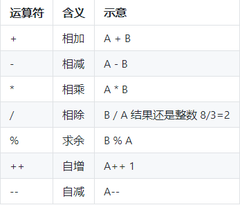
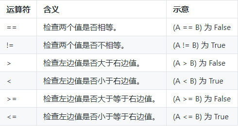
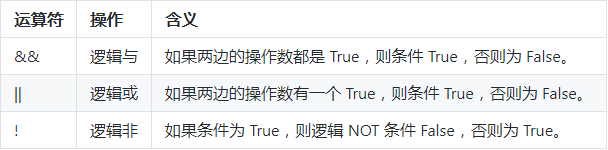
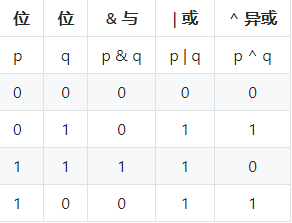

## 9.1 内置运算符
* Go语言的其他运算符：
    运算符	含义
    * __&__	 返回变量存储地址 `&a`  将给出变量的实际地址. (取地址符号)
    * __*__ 指针变量。	`*a` 是一个指针变量

* Go语言的算术运算符：
    * 

* Go语言的关系运算符：
    * 

* Go语言的逻辑运算符：
    * 

* Go语言的位运算符：
    * 位运算符对整数在内存中的二进制位进行操作
    * 
